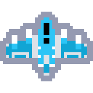
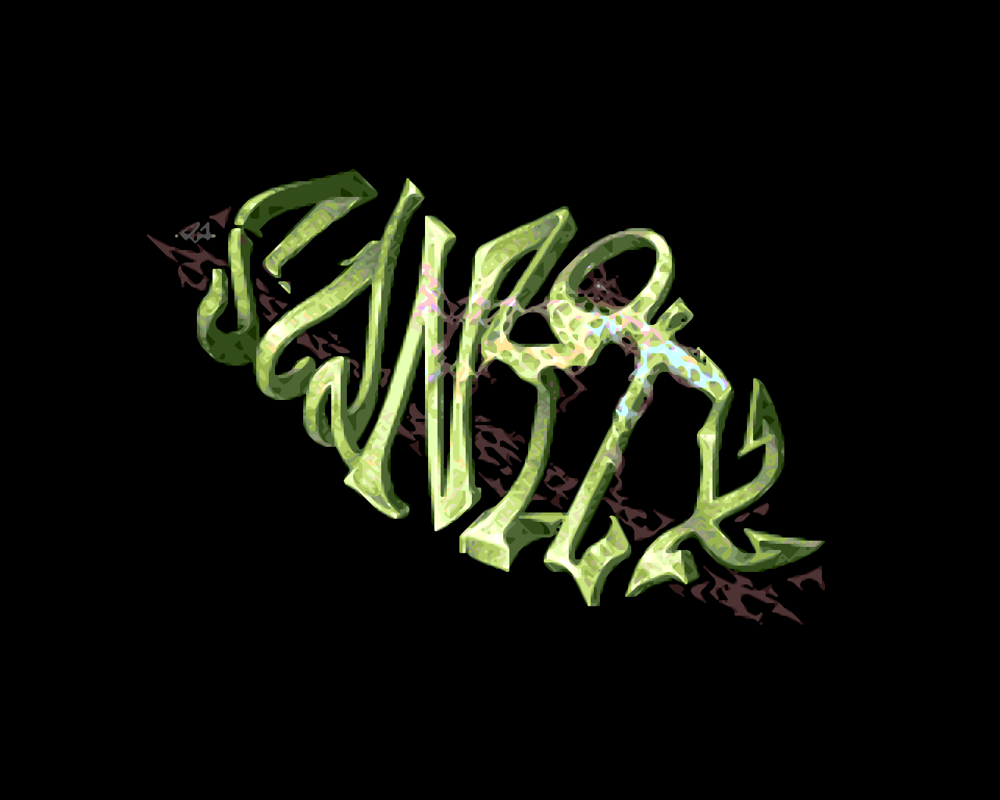

# xBRZtrace

A CLI that converts pixel art (PNG/JPEG) into **scalable SVG vectors**
using the [xBRZ](https://en.wikipedia.org/wiki/Pixel-art_scaling_algorithms#xBRZ_family)
pixel-art upscaling algorithm.

```
input.png ──► xBRZ upscale ──► vector trace ──► optimize ──► SVG (paths, not rects)
```

Instead of emitting thousands of `<rect>` elements, xBRZtrace traces each
contiguous region of identical color into a single consolidated polygon and
groups all regions of the same color into one compound `<path>`, then runs an
SVGO-style optimization pass that strips redundant control points and flattens
every loop into a minimal polyline — producing tiny, crisp SVGs that scale
cleanly to any size.

## Features

- **xBRZ scaling engine** (2x–6x) implemented from scratch in Rust, with
  corner detection, diagonal-line smoothing and per-scale blend tables.
  Verified **bit-for-bit identical** to the reference C++ implementation.
- **Alpha channel support** — semi-transparent pixels are handled correctly
  (the distance metric and all blends are alpha-aware).
- **Consolidated vector tracing** — contiguous same-color regions become
  closed polygons (`M`/`H`/`V`/`Z` path commands, never per-pixel rects);
  holes render correctly via `fill-rule="evenodd"`.
- **Seam-free output** — shapes share exact grid boundaries, rendered with
  `shape-rendering="crispEdges"`, so adjacent colors have no hairlines or
  gaps.
- **`--merge-colors`** — one compound `<path>` per RGBA color (default on;
  disable with `--merge-colors=false` for one path per connected region).
- **`--quantize`** — merge near-duplicate colors in the input before scaling,
  collapsing JPEG compression noise into clean flat regions. Takes an
  optional tolerance in perceptual color distance (default 30, the engine's
  equal-color threshold).
- **SVGO-style optimization pass** — after tracing, an `optimizer` stage
  strips redundant control points (zero-length segments, duplicate points,
  a trailing point that repeats the start) and flattens every loop into a
  minimal simple polygon, and the exporter drops the redundant
  `fill-rule="evenodd"` attribute from single-loop paths. All passes are
  exact — the rendered output is bit-identical to the unoptimized one.
- **Verbose metrics** — input/output dimensions, timing per stage, path and
  color counts, optimization stats, output size.
- Defensive error handling for missing files, corrupt data and unsupported
  scale factors.

## Build

Requires Rust 1.75+ (uses the `image`, `clap` and `anyhow` crates).

```bash
cargo build --release
```

The binary is produced at `target/release/xbrztrace`.

## Usage

```
xbrztrace -i <PATH> -o <PATH> [-s <2x|3x|4x|5x|6x>] [--merge-colors[=BOOL]] [-q [<TOL>]] [-v]
```

| Flag | Description | Default |
| ---- | ----------- | ------- |
| `-i, --input <PATH>` | Input raster file (PNG or JPEG; format sniffed from content) | required |
| `-o, --output <PATH>` | Output `.svg` file | required |
| `-s, --scale <2x\|3x\|4x\|5x\|6x>` | xBRZ scaling factor | `4x` |
| `--merge-colors` | Group identical RGBA fills into one compound `<path>` per color (`--merge-colors=false` disables) | `true` |
| `-q, --quantize [<TOL>]` | Merge near-duplicate colors in the input before scaling (tolerance in perceptual color distance; `--quantize` alone uses 30, `--quantize 64` a looser merge) | off |
| `-v, --verbose` | Print timing, dimensions, path counts and size stats to stderr | off |

### Examples

```bash
# Basic 4x upscale of a sprite
xbrztrace -i sprite.png -o sprite.svg

# 6x with timing stats
xbrztrace -i sprite.png -o sprite.svg -s 6x -v

# One path per connected region instead of one per color
xbrztrace -i sprite.png -o sprite.svg --merge-colors=false

# JPEG input
xbrztrace -i photo.jpg -o photo.svg -s 3x

# Clean up JPEG compression noise before tracing
xbrztrace -i photo.jpg -o photo.svg --quantize

# Same, with a looser merge tolerance
xbrztrace -i photo.jpg -o photo.svg --quantize 64 -v
```

Example verbose output:

```
input:      32x32 px
output:     128x128 px (4x)
colors:     41 (41 <path> elements, 240 loops)
optimize:   240 loops, 1512 -> 1512 control points (0.0% fewer)
timing:     load 0.16 ms | xbrz 0.08 ms | vectorize 0.54 ms | optimize 0.02 ms | export 0.10 ms | write 0.06 ms | total 0.97 ms
svg:        8.0 KB (8126 bytes)
```

## How it works

The pipeline lives in five modules:

| Module | Responsibility |
| ------ | -------------- |
| `cli` | Argument parsing and validation (`clap`) |
| `image_loader` | Decode PNG/JPEG into a normalized RGBA grid |
| `quantize` | Optional pre-pass: cluster near-duplicate colors within a perceptual tolerance (for lossy inputs) |
| `xbrz_engine` | The xBRZ upscaler: color distance, corner preprocessing, per-scale blend tables, scale driver |
| `vectorizer` | Boundary tracing of same-color regions into closed polygons, collinear merging, color grouping |
| `optimizer` | SVGO-style post-processing: strip redundant control points, flatten loops into minimal polylines |
| `svg_exporter` | Serialize regions into compact `<svg>` markup (elides redundant attributes) |

### xBRZ engine

Per input pixel, the engine:

1. **Preprocesses** a 4×4 neighborhood: a perceptual YCbCr (ITU-R BT.2020)
   color distance classifies each of the pixel's four corners as *no blend*,
   *normal blend* or *dominant blend*, detecting diagonal edges.
2. **Blends** a 3×3 neighborhood in four rotations. Each corner applies a
   scale-specific weight table (shallow/steep/diagonal line blending, or a
   rounded corner) to the subpixels adjacent to it, mixing the line color at
   fractional opacities.

The implementation mirrors the reference algorithm's arithmetic exactly
(including its f32-quantized color-distance lookup and integer blend math),
which is why output matches the reference byte-for-byte.

### Vector tracing

Every region boundary is walked with the region interior on the left; at each
grid vertex the tracer takes the sharpest left turn (then straight, then
right), tracing each loop exactly once. Consecutive collinear segments are
merged, so a straight run of any length emits a single `H`/`V` command. Holes
become separate loops handled by the even-odd fill rule.

### Path optimization

After tracing, the `optimizer` stage applies SVGO-style cleanup passes that
are exact (they never move a vertex, so rendering is unchanged):

- **Strip redundant control points** — zero-length segments, duplicate
  consecutive points, and a trailing point that repeats the first point
  (whose closing `Z` command already implies the return) are removed.
- **Flatten loops** — any point lying on the straight line between its
  neighbors is dropped, including across the implied closing segment,
  iterating to a fixpoint. Every loop ends up a minimal simple polygon with
  no curves.
- **Elide redundant attributes** — `fill-rule="evenodd"` is omitted for
  single-loop paths, where the default fill rule fills identically.

The tracer already merges collinear runs while tracing, so on its current
output this pass is mostly a guarantee; it is defense in depth that keeps
path data minimal even if the tracing strategy changes.

## Testing

```bash
cargo test
```

The test suite includes:

- **Golden-fixture verification** (`tests/xbrz_reference.rs`): the Rust xBRZ
  port is compared **bit-for-bit** against the output of the reference C++
  implementation (Zenju's xBRZ, GPL-licensed, compiled out-of-tree for
  verification only) for two 8×8 patterns at every scale factor 2x–6x. Only
  the numeric fixture data is committed (`tests/fixtures/xbrz_reference.txt`).
- **Round-trip tests** (`tests/vectorizer.rs`): a 16×16 test sprite is
  upscaled, traced, serialized, and the SVG is rasterized back with an
  independent even-odd renderer — the result must equal the upscaled grid
  exactly, proving there are no seams, gaps or geometry errors.
- **Property-based tests** (`tests/property.rs`, proptest): hundreds of
  randomly generated grids — including isolated pixels, nested holes,
  checkerboard noise and translucent colors — must round-trip through
  vectorize → serialize → rasterize exactly, both with and without the
  optimization pass (the optimizer must be invisible to the rendered
  output, idempotent, and never grow paths). The xBRZ engine is also
  checked for output dimensions, determinism and uniform-input stability on
  arbitrary random pixels (a panic fuzz).
- **CLI integration tests** (`tests/cli.rs`): end-to-end runs of the compiled
  binary covering every scale factor, both merge modes, verbose stats, and
  all error paths.
- Unit tests in each module (checkerboards, holes, L-shapes, transparent
  pixels, solid-color stability, etc.).

## Benchmarks

[Criterion](https://github.com/bheisler/criterion.rs) micro-benchmarks cover
the hot paths:

```bash
cargo bench                 # all benchmarks
cargo bench --bench xbrz     # scaling engine only (2x–6x, 64x64 and 128x128)
cargo bench --bench vectorizer  # tracing, optimization, export, and the full pipeline
```

Benchmark inputs are generated deterministically (a seeded scene with
rectangles, diagonals, checkerboards and transparent holes), so results are
reproducible across runs and machines. After a run, an HTML report with
regression comparisons is written to `target/criterion/`.

## Demo

A self-contained showcase page lives in [`demo/`](demo/):

```bash
cargo build --release
python3 scripts/build_demo.py   # regenerates demo/output/ and demo/index.html
```

Open `demo/index.html` in any browser (or serve the directory, e.g.
`python3 -m http.server --directory demo`). Each card shows a before/after
comparison of the original pixels against the traced SVG, with drag-to-compare
and scale-switching (2x/4x/6x) controls. All SVGs are produced by the release
binary — no hand editing. See [`demo/README.md`](demo/README.md) for image
credits.

## Comparison with libdepixelize (Kopf-Lischinski)

libdepixelize implements the Kopf-Lischinski algorithm which produces **smooth
Bézier curves**. xBRZtrace uses the xBRZ algorithm which preserves **sharp pixel-art edges**.

### Example: Ship sprite (32×32 → 192×192 at 6x)

| Original | libdepixelize (192×192) | xBRZtrace (192×192, 6x) |
|----------|----------------------|----------------------|
|  |  |  |

Run the comparison yourself:

```bash
# xBRZtrace (6x upscale + trace)
xbrztrace -i demo/images/ghost.png -o ghost_xbrz.svg -s 6x

# libdepixelize (on 6× upscaled input for same target size)
magick demo/images/ghost.png -scale 600% -interpolate Nearest -filter Point /tmp/ghost_6x.png
depixelize /tmp/ghost_6x.png -o ghost_libdepixelize.svg
```

### Example: Sanity logo (320×256 → 1280×1024 at 4x)

Pixel art by RA of Sanity.

Original:


xBRZtrace (4x):



libdepixelize (same resolution):


## License

MIT (this project). The xBRZ algorithm is by Zenju; the reference C++
implementation is GPL-licensed and is used **only** to generate the golden
test fixtures — it is not linked into or copied into this project.
